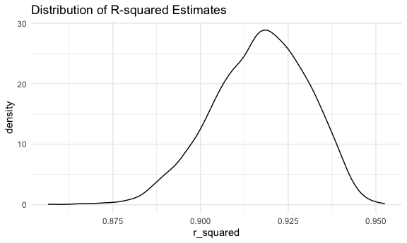
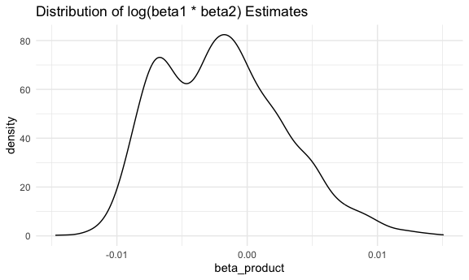

p8105_hw6_xl3371
================
Xuer Liu
2023-12-02

## Problem 2

``` r
weather_df = 
  rnoaa::meteo_pull_monitors(
    c("USW00094728"),
    var = c("PRCP", "TMIN", "TMAX"), 
    date_min = "2022-01-01",
    date_max = "2022-12-31") |>
  mutate(
    name = recode(id, USW00094728 = "CentralPark_NY"),
    tmin = tmin / 10,
    tmax = tmax / 10) |>
  select(name, id, everything())
```

``` r
set.seed(5)

# Function to generate a bootstrap sample
boot_sample <- function(df) {
  sample_frac(df, replace = TRUE)
}

# Create 5000 bootstrap samples
boot_straps <- tibble(strap_number = 1:5000) %>%
  mutate(strap_sample = map(strap_number, \(i) boot_sample(weather_df)))

fit_model_and_extract_metrics <- function(df) {
  model <- lm(tmax ~ tmin + prcp, data = df)
  r_squared <- broom::glance(model)$r.squared
  beta_product <- broom::tidy(model)$estimate[2] * broom::tidy(model)$estimate[3]
  return(list(r_squared = r_squared, beta_product = beta_product))
}
```

``` r
# Apply function to each sample and gather results
boot_results <- boot_straps %>%
  mutate(metrics = map(strap_sample, fit_model_and_extract_metrics)) %>%
  unnest_wider(metrics)
```

``` r
# Function to plot density
plot_density <- function(data, column, title) {
  ggplot(data, aes(x = .data[[column]])) +
    geom_density() +
    labs(title = title)
}

# Plot distributions
plot_density(boot_results, "r_squared", "Distribution of R-squared Estimates")
```



``` r
plot_density(boot_results, "beta_product", "Distribution of log(beta1 * beta2) Estimates")
```



The density curve for $\hat r^2$ is unimodal and slightly left skewed
distribution with a peak around 0.90. The density curve for
$\log(\hat\beta_1\times \hat\beta_2)$ is also unimodal but has a more
complex shape with what appears to be two peaks, one near -0.01 and
another small peak near 0.00.

``` r
# calculate and print CIs
calculate_and_print_ci <- function(data, column) {
  ci <- data %>%
    filter(!is.nan(!!sym(column))) %>%
    summarize(
      ci_lower = quantile(!!sym(column), 0.025),
      ci_upper = quantile(!!sym(column), 0.975)
    ) %>%
    knitr::kable(digits = 3)
  print(ci)
}

calculate_and_print_ci(boot_results, "r_squared")
```

    ## 
    ## 
    ## | ci_lower| ci_upper|
    ## |--------:|--------:|
    ## |    0.889|     0.94|

``` r
calculate_and_print_ci(boot_results, "beta_product")
```

    ## 
    ## 
    ## | ci_lower| ci_upper|
    ## |--------:|--------:|
    ## |   -0.009|    0.008|

## Problem 3
