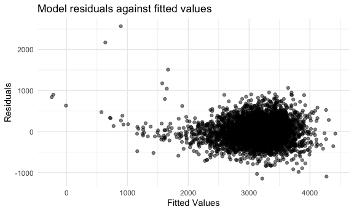

p8105_hw6_xl3371
================
Xuer Liu
2023-12-02

## Problem 2

``` r
weather_df = 
  rnoaa::meteo_pull_monitors(
    c("USW00094728"),
    var = c("PRCP", "TMIN", "TMAX"), 
    date_min = "2022-01-01",
    date_max = "2022-12-31") |>
  mutate(
    name = recode(id, USW00094728 = "CentralPark_NY"),
    tmin = tmin / 10,
    tmax = tmax / 10) |>
  select(name, id, everything())
```

``` r
set.seed(5)

# Function to generate a bootstrap sample
boot_sample <- function(df) {
  sample_frac(df, replace = TRUE)
}

# Create 5000 bootstrap samples
boot_straps <- tibble(strap_number = 1:5000) %>%
  mutate(strap_sample = map(strap_number, \(i) boot_sample(weather_df)))

fit_model <- function(df) {
  model <- lm(tmax ~ tmin + prcp, data = df)
  r_squared <- broom::glance(model)$r.squared
  beta_product <- broom::tidy(model)$estimate[2] * broom::tidy(model)$estimate[3]
  return(list(r_squared = r_squared, beta_product = beta_product))
}
```

``` r
# Apply function to each sample and gather results
boot_results <- boot_straps %>%
  mutate(metrics = map(strap_sample, fit_model)) %>%
  unnest_wider(metrics)
```

``` r
# Function to plot density
plot_density <- function(data, column, title) {
  ggplot(data, aes(x = .data[[column]])) +
    geom_density() +
    labs(title = title)
}

# Plot distributions
plot_density(boot_results, "r_squared", "Distribution of R-squared Estimates")
```


``` r
plot_density(boot_results, "beta_product", "Distribution of log(beta1 * beta2) Estimates")
```


The density curve for $\hat r^2$ is unimodal and slightly left skewed
distribution with a peak around 0.90. The density curve for
$\log(\hat\beta_1\times \hat\beta_2)$ is also unimodal but has a more
complex shape with what appears to be two peaks, one near -0.01 and
another small peak near 0.00.

``` r
# calculate and print CIs
calculate_and_print_ci <- function(data, column) {
  ci <- data %>%
    filter(!is.nan(!!sym(column))) %>%
    summarize(
      ci_lower = quantile(!!sym(column), 0.025),
      ci_upper = quantile(!!sym(column), 0.975)
    ) %>%
    knitr::kable(digits = 3)
  print(ci)
}

calculate_and_print_ci(boot_results, "r_squared")
```

    ## 
    ## 
    ## | ci_lower| ci_upper|
    ## |--------:|--------:|
    ## |    0.889|     0.94|

``` r
calculate_and_print_ci(boot_results, "beta_product")
```

    ## 
    ## 
    ## | ci_lower| ci_upper|
    ## |--------:|--------:|
    ## |   -0.009|    0.008|

## Problem 3

``` r
birthweight_df <- 
  read_csv("./data/birthweight.csv", na = c("", "NA", "Unknown")) %>% 
  janitor::clean_names() %>%
  mutate(
    babysex = as.factor(babysex),
    frace = as.factor(frace),
    malform = as.factor(malform),
    mrace = as.factor(mrace)
  ) 

# check for missing data
sum(is.na(birthweight_df))
```

    ## [1] 0

``` r
library(ggplot2)
my_model <- lm(bwt ~ gaweeks + blength + bhead + smoken + ppbmi, data=birthweight_df)

birthweight_df %>% 
  add_predictions(my_model) %>% 
  add_residuals(my_model) %>% 
  ggplot(
    aes( x = pred, y = resid)) + 
    geom_point(alpha = 0.5) +
  labs(
    title = "Model residuals against fitted values",
    x = "Fitted Values",
    y = "Residuals"
      )
```



``` r
library(caret)
```

    ## Loading required package: lattice

    ## 
    ## Attaching package: 'caret'

    ## The following object is masked from 'package:purrr':
    ## 
    ##     lift

``` r
# Model 1
model1 <- lm(bwt ~ blength + gaweeks, data=birthweight_df)

# Model 2
model2 <- lm(bwt ~ bhead * blength * babysex, data=birthweight_df)

# Function to calculate cross-validated prediction error
cv_error <- function(my_model, data) {
  cv <- trainControl(method = "cv", number = 10)
  train(bwt ~ ., data = data, method = "lm", trControl = cv)$results$RMSE
}

# Cross-validated prediction errors
error_original <- cv_error(my_model, birthweight_df)
error_model1 <- cv_error(model1, birthweight_df)
error_model2 <- cv_error(model2, birthweight_df)

# Comparison
error_comparison <- data.frame(Original = error_original, Model1 = error_model1, Model2 = error_model2)

error_comparison
```

    ##   Original   Model1   Model2
    ## 1 273.4462 273.2932 273.3458

Model 1, which is the one using length at birth and gestational age as
predictors (main effects only), has the lowest RMSE, which suggests that
it is the best model for predicting birthweight among the three models,
based on the cross-validated prediction error.
